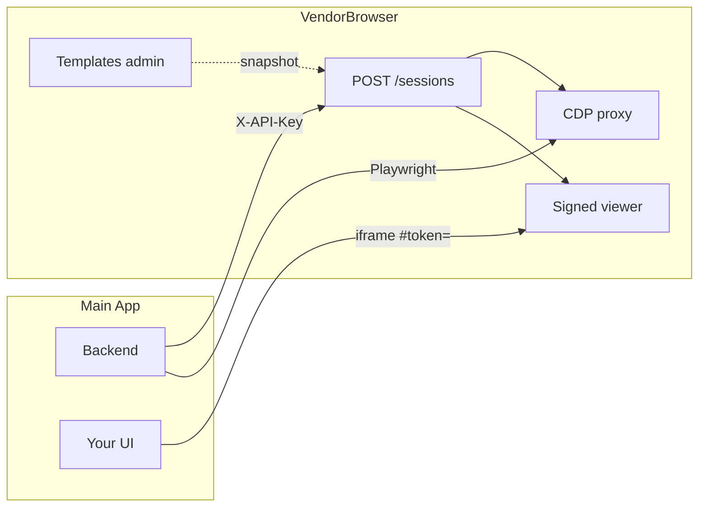

<p align="center">

</p>

<h3 align="center">VendorBrowser — powered by CloakBrowser</h3>

<p align="center">
Single-host browser profile service for one downstream app.<br>
Warm-pooled Chromium, vendor templates, CDP automation, and signed iframe viewers.
</p>

<p align="center">
<a href="https://github.com/CloakHQ/CloakBrowser"></a>
<a href="https://hub.docker.com/r/nowkickback/vendorbrowser"></a>
<a href="LICENSE"></a>
</p>

---

VendorBrowser manages **one durable Chromium profile per `(vendor_type, vendor_connection_id)`**. Each profile inherits a **vendor template** (fingerprint, locale, timezone, launch flags) and keeps cookies and storage on disk across warm-pool sleep/wake cycles.

Your **Main App** (single trusted consumer) calls:

```http
POST /sessions
X-API-Key: <MAIN_APP_API_KEY>

{"vendor_type": "acme_portal", "vendor_connection_id": "conn_abc123"}
```

and receives a **CDP URL** for Playwright automation plus a **signed `vnc_viewer_url`** to embed for human login / 2FA.

Operators use the **admin dashboard** to define vendor templates and inspect running sessions. End users never touch VendorBrowser directly — they only see the iframe inside your product.

Full integration guide for implementers: **[docs/MAIN_APP_INTEGRATION.md](docs/MAIN_APP_INTEGRATION.md)**.

---

## Quick start (Docker)

```bash
cp .env.example .env
# Edit .env: set MAIN_APP_API_KEY, VIEWER_SECRET, MAIN_APP_ORIGIN, AUTH_TOKEN

docker compose up --build
```

- **Admin UI:** [http://localhost:8080](http://localhost:8080) (login if `AUTH_TOKEN` is set)
- **Data:** `~/.vendorbrowser` on the host → `/data` in the container (SQLite + profile dirs)

Production image:

```bash
docker pull nowkickback/vendorbrowser:latest

docker run -d --name vendorbrowser \
  -p 8080:8080 \
  -v vendorbrowser-data:/data \
  -e MAIN_APP_API_KEY="$(python -c 'import secrets; print(secrets.token_urlsafe(32))')" \
  -e VIEWER_SECRET="$(python -c 'import secrets; print(secrets.token_hex(32))')" \
  -e MAIN_APP_ORIGIN=https://your-main-app.example.com \
  -e AUTH_TOKEN=your-admin-token \
  nowkickback/vendorbrowser:latest
```

The service **refuses to start** without `MAIN_APP_API_KEY` and `VIEWER_SECRET` unless `DEV_MODE=1` (local dev only).

---

## How it fits together



| Role | What they do |
|------|----------------|
| **Operator** | Create/edit **vendor templates** per `vendor_type` in the admin UI |
| **Main App backend** | `POST /sessions`, CDP automation, optional `GET/DELETE` session & profile APIs |
| **End user** | Completes vendor login in your app via embedded **viewer iframe** |

---

## Features (v1.0)

### Vendor templates

- Admin CRUD for templates keyed by `vendor_type` (fingerprint, proxy, locale, timezone, platform, screen, GPU, humanize, `launch_args`, `clipboard_sync`)
- Template fields are **snapshot-copied** into each profile at creation; editing a template does not change existing profiles
- `clipboard_sync` defaults to **false** everywhere

### Sessions & warm pool

- **Idempotent** `POST /sessions` — one profile per `(vendor_type, vendor_connection_id)`
- Browser stays up while **CDP** or **viewer** is attached; sleeps after `IDLE_TIMEOUT_SECONDS` (default 600s) when both are detached
- Launch guarded by `asyncio.Semaphore(3)`; stale Chromium singleton files cleaned before launch
- `about:blank` probe after launch to detect silent failures
- `GET /sessions/{profile_id}` for attach counts and idle expiry; `DELETE /sessions/{profile_id}` to force-stop without deleting data

### Signed viewer (iframe)

- Short-lived HS256 JWT in URL **fragment** only: `/viewer/{profile_id}#token=…` (never querystring)
- Single-use JTI on WebSocket connect; CSP `frame-ancestors` restricted to `MAIN_APP_ORIGIN`
- External embed script (no inline JS) for strict CSP

### Machine API (`/profiles`)

- Lookup by `vendor_type` + `vendor_connection_id`
- Notes-only `PATCH`; `DELETE` removes row and on-disk profile directory
- All machine routes require `X-API-Key` — separate from admin auth

### Admin dashboard

- **Templates** — configure vendors
- **Sessions** — ops list (`vendor_type`, connection id, state, attach counts, idle timer)
- Open **admin VNC** for running/idle sessions (warm-pool aware)
- Legacy end-user profile CRUD and Launch/Stop removed (**410**)

### Security

- **Two auth surfaces:** `X-API-Key` on `/sessions`, `/profiles`, CDP WebSocket vs admin bearer/cookie on `/api/*`
- Machine route cannot read clipboard without viewer token
- Admin API responses: `frame-ancestors 'none'`; admin cookie `SameSite=Strict`, `HttpOnly`

---

## API overview

**Base URL:** your VendorBrowser host (e.g. `https://browser.internal`)

| Method | Path | Auth | Purpose |
|--------|------|------|---------|
| `POST` | `/sessions` | `X-API-Key` | Upsert + wake; returns `profile_id`, `cdp_url`, `vnc_viewer_url`, `state` |
| `GET` | `/sessions/{profile_id}` | `X-API-Key` | Status envelope |
| `DELETE` | `/sessions/{profile_id}` | `X-API-Key` | Stop browser; keep profile data |
| `GET` | `/profiles?...` | `X-API-Key` | List/filter profiles |
| `DELETE` | `/profiles/{profile_id}` | `X-API-Key` | Delete profile + disk |
| `GET` | `/viewer/{profile_id}` | JWT in `#token=` | iframe shell (embed in Main App) |
| WS | `/api/profiles/{id}/cdp` | `X-API-Key` on upgrade | Playwright CDP proxy |

**CDP example** (from Main App backend):

```python
from playwright.async_api import async_playwright

BASE = "https://browser.internal"
API_KEY = "..."  # MAIN_APP_API_KEY — never expose to browsers

async with async_playwright() as pw:
    browser = await pw.chromium.connect_over_cdp(
        f"{BASE}/api/profiles/{profile_id}/cdp",
        headers={"X-API-Key": API_KEY},
    )
    page = browser.contexts[0].pages[0]
    await page.goto("https://vendor.example.com")
    await browser.close()
```

See **[docs/MAIN_APP_INTEGRATION.md](docs/MAIN_APP_INTEGRATION.md)** for flows (new account connect, 2FA iframe, disconnect, errors).

---

## Environment variables

Copy [`.env.example`](.env.example) → `.env`.

| Variable | Required (prod) | Description |
|----------|-----------------|-------------|
| `MAIN_APP_API_KEY` | Yes | Shared secret; `X-API-Key` on machine routes |
| `VIEWER_SECRET` | Yes | HMAC secret for viewer JWTs (HS256) |
| `MAIN_APP_ORIGIN` | Yes* | Origin allowed to embed `/viewer/*` (e.g. `https://app.example.com`) |
| `AUTH_TOKEN` | Recommended | Admin dashboard + `/api/*` bearer/cookie |
| `IDLE_TIMEOUT_SECONDS` | No | Warm-pool idle before stop (default `600`) |
| `VIEWER_TOKEN_TTL_SECS` | No | Viewer JWT TTL (default `300`) |
| `CHROME_UID` | No | `chown` target for `/data/profiles` (default `0`) |
| `DEV_MODE` | No | `1` = skip fail-closed check for missing secrets (**dev only**) |

\*Required for iframe embedding in production; unset limits `frame-ancestors` to `'self'`.

---

## Stack

| Layer | Technology |
|-------|------------|
| API | Python 3.12, FastAPI, Pydantic 2, SQLite |
| Admin UI | React 19, TypeScript, Vite, Tailwind |
| Browser | [CloakBrowser](https://github.com/CloakHQ/CloakBrowser) + Playwright |
| Viewer | KasmVNC + noVNC 1.4, custom RFB filter |
| Tokens | PyJWT ≥ 2.12 |

---

## Development

### Prerequisites

| Tool | Version |
|------|---------|
| Docker | 20.10+ (recommended — includes Chromium + VNC) |
| Python | 3.11+ (3.12 in image) |
| Node.js | 20+ |

### Docker Compose (full stack)

```bash
cp .env.example .env
# DEV_MODE=1 is fine for local API-only experiments

docker compose up --build
```

### Split stack (UI hot reload)

**API** (from `backend/`):

```bash
cd backend
python -m venv .venv && source .venv/bin/activate
pip install -r requirements.txt
set -a && source ../.env && set +a
uvicorn asgi:app --reload --port 8080
```

**Frontend:**

```bash
cd frontend && npm install && npm run dev
```

UI: [http://localhost:5173](http://localhost:5173) — set `MAIN_APP_ORIGIN=http://localhost:5173` if testing viewer iframes.

Browser launch and VNC require Docker or a Linux host with the same deps as the [Dockerfile](Dockerfile).

### Tests

From repo root:

```bash
pip install -r backend/requirements.txt pytest
pytest                    # fast suite (281 tests)
pytest -m slow            # real Chromium sleep/wake e2e

cd frontend && npm test   # 10 tests
```

---

## CI & Docker images

GitHub Actions builds multi-arch (`linux/amd64`, `linux/arm64`) images and pushes to Docker Hub on pushes to `main` and on version tags (`v*`).

| Event | Image tags |
|-------|------------|
| Push to `main` | `nowkickback/vendorbrowser:latest`, `nowkickback/vendorbrowser:sha-<short>` |
| Tag `v1.0.0` | `nowkickback/vendorbrowser:1.0.0`, `1.0`, `1`, `latest` |

**Repo secrets required** (Settings → Secrets → Actions):

- `DOCKERHUB_USERNAME`
- `DOCKERHUB_TOKEN` (Docker Hub access token with push access)

Pull requests run **build only** (no push).

Workflow: [`.github/workflows/docker.yml`](.github/workflows/docker.yml)

---

## Operations

| Resource | Guidance |
|----------|----------|
| **RAM** | ~512 MB per running profile (order of magnitude) |
| **Disk** | `/data` volume — profiles + SQLite; back up the volume |
| **Updates** | `docker pull nowkickback/vendorbrowser:latest` and recreate container; data persists on the volume |
| **Remote access** | Bind behind VPN or `ssh -L 8080:localhost:8080 host`; use HTTPS in production |
| **Templates** | Create each `vendor_type` in admin **before** Main App users connect |

---

## Authentication summary

| Surface | Credential |
|---------|------------|
| Machine API `/sessions`, `/profiles` | Header `X-API-Key: <MAIN_APP_API_KEY>` |
| CDP WebSocket | `X-API-Key` on upgrade |
| Viewer `/viewer/*` | JWT in URL fragment (minted by VendorBrowser) |
| Admin `/api/*` + dashboard | `AUTH_TOKEN` bearer or cookie |

Use HTTPS in production. Do not expose `MAIN_APP_API_KEY` to browsers.

---

## Planning & architecture notes

Internal GSD planning artifacts live in [`.planning/`](.planning/) (roadmap, v1.0 milestone archive). Contributor-oriented invariants: [`CLAUDE.md`](CLAUDE.md).

---

## License

- **Application source** — MIT ([LICENSE](LICENSE))
- **CloakBrowser binary** — separate terms ([BINARY-LICENSE.md](BINARY-LICENSE.md)); downloaded on first launch

---

## Links

- **Main App integration** — [docs/MAIN_APP_INTEGRATION.md](docs/MAIN_APP_INTEGRATION.md)
- **CloakBrowser** — [github.com/CloakHQ/CloakBrowser](https://github.com/CloakHQ/CloakBrowser)
- **Docker Hub** — [hub.docker.com/r/nowkickback/vendorbrowser](https://hub.docker.com/r/nowkickback/vendorbrowser)
- **Issues** — [github.com/CloakHQ/CloakBrowser-Manager/issues](https://github.com/CloakHQ/CloakBrowser-Manager/issues)
