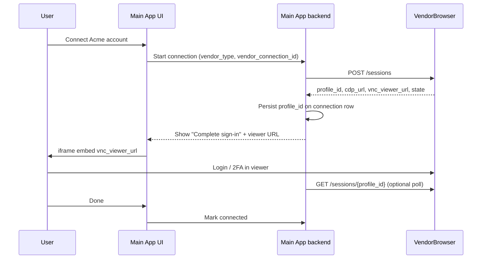
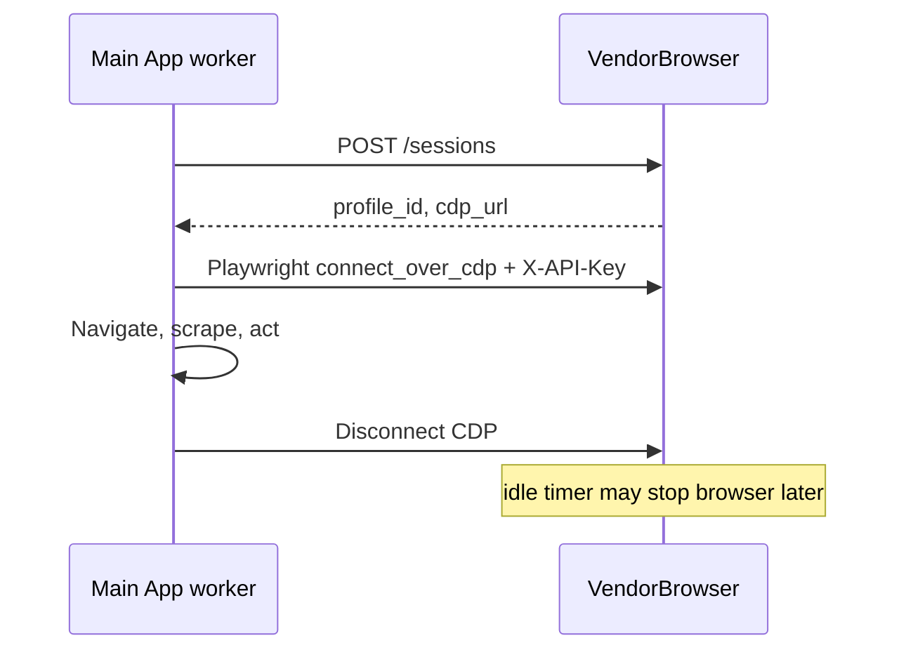

# Main App integration guide (for LLM implementers)

This document describes how a **downstream “Main App”** should integrate with **VendorBrowser** (CloakBrowser-Manager v1.0) to:

1. Connect a new vendor account (`vendor_type` + `vendor_connection_id`)
2. Run automation against a warm, persistent Chromium profile (CDP)
3. Prompt an end user to complete login / 2FA in a signed iframe viewer
4. Tear down or retain sessions according to warm-pool rules

VendorBrowser is a **single trusted consumer** service. The Main App is the only machine client. End users never call VendorBrowser directly except via the iframe embedded in the Main App UI.

---

## Mental model

| Concept | Owner | Notes |
|--------|--------|--------|
| `vendor_type` | Main App + VendorBrowser admin | String key for a vendor portal (e.g. `stripe`, `amazon_seller`). Must have a **vendor template** in VendorBrowser admin first. |
| `vendor_connection_id` | Main App | Opaque ID for *this user’s* connection to that vendor (your DB primary key / UUID). VendorBrowser does not know your user identity. |
| `profile_id` | VendorBrowser | UUID for the durable Chromium profile row. Stable for the life of the `(vendor_type, vendor_connection_id)` pair. |
| Browser state | VendorBrowser warm pool | Cookies/localStorage live on disk. Profile **sleeps** after idle timeout when nothing is attached. |
| Automation | Main App via CDP | Playwright/Puppeteer connects to VendorBrowser’s CDP proxy. |
| Human intervention | Main App iframe | Embeds signed `vnc_viewer_url`; user interacts via noVNC. |

**Canonical happy path:** one idempotent call:

```http
POST /sessions
X-API-Key: <MAIN_APP_API_KEY>
Content-Type: application/json

{"vendor_type": "acme_portal", "vendor_connection_id": "conn_9f3c..."}
```

Response:

```json
{
  "profile_id": "550e8400-e29b-41d4-a716-446655440000",
  "cdp_url": "/api/profiles/550e8400-e29b-41d4-a716-446655440000/cdp",
  "vnc_viewer_url": "/viewer/550e8400-e29b-41d4-a716-446655440000#token=eyJ...",
  "state": "running"
}
```

Resolve relative URLs against your configured **VendorBrowser base URL** (e.g. `https://vendorbrowser.internal`).

---

## Prerequisites (before Main App code)

### 1. VendorBrowser deployment

- Reachable from Main App backend and from **end-user browsers** (for iframe viewer).
- Production must set (service refuses to start otherwise):
  - `MAIN_APP_API_KEY` — shared secret for machine routes
  - `VIEWER_SECRET` — HMAC secret for viewer JWTs (Main App does **not** need this value)
  - `MAIN_APP_ORIGIN` — exact origin of the Main App UI (scheme + host + port), used in CSP `frame-ancestors` for `/viewer/*`

See `.env.example` in this repo for full list (`IDLE_TIMEOUT_SECONDS`, `VIEWER_TOKEN_TTL_SECS`, etc.).

### 2. Vendor template per `vendor_type`

An operator must create a template in the **VendorBrowser admin dashboard** (Templates page) before `POST /sessions` can succeed for that `vendor_type`.

If no template exists:

```http
HTTP/1.1 404 Not Found
{"detail": "No template for vendor_type='acme_portal'", "vendor_type": "acme_portal"}
```

Main App should surface a clear ops error (“vendor not configured”) rather than retrying blindly.

### 3. Main App configuration

Store in your secrets/config:

| Setting | Example | Use |
|---------|---------|-----|
| `VENDOR_BROWSER_BASE_URL` | `https://browser.svc.internal` | Prefix for `cdp_url` and `vnc_viewer_url` |
| `VENDOR_BROWSER_API_KEY` | (matches `MAIN_APP_API_KEY`) | `X-API-Key` on all machine HTTP + CDP WebSocket |

**Do not** store or use `VIEWER_SECRET` in the Main App. Viewer tokens are minted only by VendorBrowser.

---

## Authentication

Two **strictly separate** surfaces (never mix):

| Surface | Paths | Credential |
|---------|-------|------------|
| **Machine API** | `/sessions/*`, `/profiles/*` | Header `X-API-Key: <MAIN_APP_API_KEY>` |
| **Viewer** | `/viewer/*` | JWT in URL **fragment** `#token=...` (no API key) |
| **CDP proxy** | `/api/profiles/{profile_id}/cdp` (WebSocket) | Header `X-API-Key` on WS upgrade |
| **Admin** | `/api/*` (except machine paths), dashboard | `Authorization: Bearer` or `auth_token` cookie — **not for Main App** |

Missing/invalid API key → `401` with `{"detail": "Invalid or missing API key"}`.

---

## Session lifecycle (what `state` means)

VendorBrowser keeps a browser **warm** while either:

- a CDP client is connected (`cdp_attach_count > 0`), or
- a viewer WebSocket is connected (`viewer_attach_count > 0`)

When **both** counts are zero, an idle timer starts (`IDLE_TIMEOUT_SECONDS`, default 600s). When it fires, Chromium stops; state becomes `stopped`. Disk profile (cookies, etc.) remains.

| `state` in API | Meaning |
|----------------|---------|
| `running` | Chromium process up; may have active attaches |
| `idle` | Chromium still up, both attach counts zero, idle timer running |
| `stopped` | Chromium not running; profile row and on-disk data remain |

**Implications for Main App:**

- After automation disconnects CDP, the session may go `idle` then `stopped` — that is normal.
- Next `POST /sessions` for the same pair **wakes** the profile (reloads cookies from disk).
- While a user is in the iframe viewer, `viewer_attach_count > 0` — idle shutdown is delayed (good for 2FA).

Poll status:

```http
GET /sessions/{profile_id}
X-API-Key: ...
```

```json
{
  "state": "idle",
  "cdp_attach_count": 0,
  "viewer_attach_count": 1,
  "idle_expires_at": "2026-05-19T18:00:00+00:00",
  "last_launched_at": "2026-05-19T17:55:00+00:00"
}
```

---

## API reference (machine routes)

Base: `{VENDOR_BROWSER_BASE_URL}`  
All requests: header `X-API-Key`.

### Sessions

| Method | Path | Purpose |
|--------|------|---------|
| `POST` | `/sessions` | Idempotent upsert + wake; returns CDP + viewer URLs |
| `GET` | `/sessions` | List profiles currently running in memory (may be empty) |
| `GET` | `/sessions/{profile_id}` | Status envelope |
| `DELETE` | `/sessions/{profile_id}` | Force-stop browser; **keeps** profile row and disk data (`204`) |

**`POST /sessions` body** (extra fields rejected):

```json
{
  "vendor_type": "non-empty string",
  "vendor_connection_id": "non-empty string"
}
```

**Success `200` body:**

```json
{
  "profile_id": "uuid",
  "cdp_url": "/api/profiles/{profile_id}/cdp",
  "vnc_viewer_url": "/viewer/{profile_id}#token={jwt}",
  "state": "running" | "idle" | "stopped"
}
```

**Errors:**

| Status | When |
|--------|------|
| `400` | Invalid JSON / validation |
| `401` | Bad/missing API key |
| `404` | No template for `vendor_type` |
| `503` | Browser launch failed (`detail`, `reason`) |

**Concurrency:** parallel `POST /sessions` for the same pair serialize safely; you always get one profile.

### Profiles (metadata & lifecycle)

| Method | Path | Purpose |
|--------|------|---------|
| `GET` | `/profiles?vendor_type=&vendor_connection_id=` | Lookup (empty list if none — not 404) |
| `GET` | `/profiles/{profile_id}` | Single profile metadata |
| `PATCH` | `/profiles/{profile_id}` | Notes only (`{"notes": "..."}`); identity keys immutable |
| `DELETE` | `/profiles/{profile_id}` | Delete row **and** on-disk profile directory |

Use `DELETE /profiles/{id}` when the user disconnects the account in Main App permanently. Use `DELETE /sessions/{id}` when you only want to stop the browser but keep credentials for later.

---

## End-to-end flows

### Flow A — User connects a new vendor account



**Implementation steps:**

1. **Allocate** `vendor_connection_id` in your DB (if not already).
2. **`POST /sessions`** with your stable `vendor_type` string and that ID.
3. **Persist** `profile_id` on the connection record.
4. **Show UI** for human login (Flow C) if the account is not yet authenticated.
5. Optionally **`GET /profiles?...`** to confirm row exists after first session.

You do **not** create profiles via admin CRUD or custom fingerprint APIs. Template defines fingerprint; VendorBrowser snapshots it at creation.

### Flow B — Automated sync (no user at keyboard)



1. `POST /sessions` (same pair as always).
2. Connect Playwright to absolute CDP URL (see below).
3. Run automation; cookies persist on disk even after browser stops.
4. Disconnect CDP when finished — do not call `DELETE /sessions` unless you need an immediate hard stop.

### Flow C — Prompt user to connect / fix session (iframe viewer)

Use when:

- First-time vendor login
- 2FA / CAPTCHA / “verify it’s you”
- Session expired on vendor site

1. `POST /sessions` (mint a **fresh** `vnc_viewer_url` each time).
2. Build iframe URL:

   ```text
   {VENDOR_BROWSER_BASE_URL}{vnc_viewer_url}
   ```

   Example:

   ```text
   https://browser.internal/viewer/550e8400-...#token=eyJhbGciOiJIUzI1NiIs...
   ```

3. Embed in your page:

   ```html
   <iframe
     src="https://browser.internal/viewer/PROFILE_ID#token=JWT"
     allow="clipboard-read; clipboard-write"
     style="width:100%;height:720px;border:0"
     title="Vendor sign-in"
   ></iframe>
   ```

**Critical security rules:**

| Rule | Why |
|------|-----|
| Token only in **fragment** (`#token=`), never in query (`?token=`) | Query strings appear in logs and Referer |
| Do not log full `vnc_viewer_url` | Contains bearer-equivalent JWT |
| `MAIN_APP_ORIGIN` must match the page embedding the iframe | CSP `frame-ancestors` blocks other origins |
| Treat each URL as **single-use** | JWT `jti` is consumed on first viewer WebSocket connect |

If the user closes the iframe and needs to try again, call **`POST /sessions` again** for a new token. Reusing the same URL after a successful viewer connection will fail (replay protection).

**Token TTL:** default 300s (`VIEWER_TOKEN_TTL_SECS`). Open the iframe promptly after minting.

### Flow D — User disconnects account in Main App

1. `DELETE /sessions/{profile_id}` — stop browser if running (idempotent).
2. `DELETE /profiles/{profile_id}` — remove VendorBrowser row and on-disk data.
3. Delete your local connection row.

Order matters if you want a clean wipe: session stop is optional if you delete the profile entirely.

---

## CDP / Playwright automation

`cdp_url` in the session response is a **path**. Full URL:

```text
{VENDOR_BROWSER_BASE_URL}/api/profiles/{profile_id}/cdp
```

The CDP **WebSocket** upgrade requires `X-API-Key` (browser clients do not use admin cookies).

### Python (Playwright async)

```python
import os
from playwright.async_api import async_playwright

BASE = os.environ["VENDOR_BROWSER_BASE_URL"].rstrip("/")
API_KEY = os.environ["VENDOR_BROWSER_API_KEY"]

async def run_automation(profile_id: str):
    cdp_http = f"{BASE}/api/profiles/{profile_id}/cdp"
    headers = {"X-API-Key": API_KEY}

    async with async_playwright() as pw:
        browser = await pw.chromium.connect_over_cdp(
            cdp_http,
            headers=headers,
        )
        context = browser.contexts[0] if browser.contexts else await browser.new_context()
        page = context.pages[0] if context.pages else await context.new_page()
        await page.goto("https://vendor.example.com/dashboard")
        # ... your automation ...
        await browser.close()  # disconnect CDP; VendorBrowser decrements attach count
```

If your Playwright version does not support `headers` on `connect_over_cdp`, use a supported version or a CDP client that can set extra headers on the WebSocket handshake.

### Node (Playwright)

```javascript
const { chromium } = require("playwright");

const BASE = process.env.VENDOR_BROWSER_BASE_URL.replace(/\/$/, "");
const API_KEY = process.env.VENDOR_BROWSER_API_KEY;

async function runAutomation(profileId) {
  const browser = await chromium.connectOverCDP(
    `${BASE}/api/profiles/${profileId}/cdp`,
    { headers: { "X-API-Key": API_KEY } }
  );
  const page = browser.contexts()[0]?.pages()[0] ?? (await browser.newPage());
  await page.goto("https://vendor.example.com/dashboard");
  await browser.close();
}
```

**While CDP is connected**, warm-pool idle shutdown is suppressed (`cdp_attach_count > 0`).

---

## Suggested Main App data model

```text
vendor_connections
  id                    -- your vendor_connection_id (send to VendorBrowser)
  user_id
  vendor_type           -- e.g. "acme_portal"
  vendorbrowser_profile_id  -- nullable until first POST /sessions
  status                -- pending_login | active | error | disconnected
  last_session_at
```

**Mapping:**

- `vendor_type` → VendorBrowser template key (configure in admin).
- `vendor_connection_id` → your `id` (string; UUID recommended).
- `vendorbrowser_profile_id` → `profile_id` from `POST /sessions`.

---

## UI patterns (copy-friendly)

### “Connect Acme” button

```text
1. Ensure vendor template exists (ops / admin checklist).
2. POST /sessions { vendor_type: "acme_portal", vendor_connection_id: <row.id> }
3. Save profile_id on row.
4. Navigate to /connections/<id>/sign-in
5. Page renders iframe with absolute vnc_viewer_url
6. Poll GET /sessions/{profile_id} every 5s OR user clicks "I've finished"
7. Optionally run POST /sessions + CDP to verify logged-in state
8. Set status = active
```

### “Open browser to fix login” (existing connection)

Same as above — always **`POST /sessions` first** to wake the profile and mint a **new** viewer token.

### Background job

```text
POST /sessions → connect CDP → work → close CDP
```

Handle `503` with backoff (launch slot / Chromium failure). Handle `404` as misconfigured vendor template.

---

## Error handling cheat sheet

| Symptom | Likely cause | Main App action |
|---------|----------------|-----------------|
| `404` on POST /sessions | No template for `vendor_type` | Ops: create template; show “vendor unavailable” |
| `401` | Wrong/missing API key | Fix secrets; alert |
| `503` launch failed | Resource limits, bad profile dir | Retry with backoff; surface `reason` |
| iframe blank / refused to frame | `MAIN_APP_ORIGIN` mismatch | Align CSP origin with exact UI origin |
| iframe “Missing viewer token” | Stripped URL fragment | Never strip `#token=`; avoid redirect chains that drop hash |
| iframe disconnect / 4401 on WS | Expired or replayed token | POST /sessions again for fresh URL |
| CDP `4401` | Missing `X-API-Key` on WS | Pass header on connect_over_cdp |
| CDP `4004` | Profile stopped | POST /sessions to wake |
| User completed 2FA but job sees logged out | Browser idle-stopped | POST /sessions before CDP; check `state` |

---

## Security checklist (implementer)

- [ ] Call machine routes only from **Main App backend**, never from browser JavaScript (API key must not ship to clients).
- [ ] Pass `vnc_viewer_url` to the frontend only over your authenticated session (short-lived page token optional).
- [ ] Never put viewer JWT in query parameters, logs, analytics, or support tickets.
- [ ] Set `MAIN_APP_ORIGIN` to the production UI origin before go-live.
- [ ] Use HTTPS for Main App and VendorBrowser in production (tokens and API key are sensitive on the wire).
- [ ] Do not call `GET /profiles/{id}/clipboard` from Main App — clipboard is viewer-scoped; machine API receives `403` by design.

---

## What Main App should NOT do

| Don't | Do instead |
|-------|------------|
| Create profiles via old `/api/profiles` admin CRUD | `POST /sessions` |
| Call `/api/profiles/{id}/launch` or `/stop` | Removed (410) |
| Mint or validate viewer JWTs locally | Use `vnc_viewer_url` from VendorBrowser |
| Share `MAIN_APP_API_KEY` with browsers | Backend-only |
| Reuse one viewer URL for multiple users | One mint per user session; JTI is single-use |
| Assume browser stays up forever | `POST /sessions` before each automation burst |
| Manage fingerprint fields per connection | Configure vendor **template** in admin |

---

## Optional: verify template exists (ops)

Templates are managed in VendorBrowser admin (`/api/templates` with admin auth), not via machine API. For v1, operational runbooks should ensure each `vendor_type` your product supports has a template before users connect.

Future milestones may add machine-readable template APIs; do not assume them in v1.

---

## Quick test (curl)

```bash
export VB=https://vendorbrowser.internal
export KEY=your-main-app-api-key

# Wake / create session
curl -sS -X POST "$VB/sessions" \
  -H "X-API-Key: $KEY" \
  -H "Content-Type: application/json" \
  -d '{"vendor_type":"acme_portal","vendor_connection_id":"test-conn-1"}' | jq .

# Status
curl -sS "$VB/sessions/<profile_id>" -H "X-API-Key: $KEY" | jq .
```

---

## Reference implementation location (VendorBrowser repo)

| Area | Path |
|------|------|
| Sessions router | `backend/routers/sessions.py` |
| Profiles router | `backend/routers/profiles.py` |
| Viewer routes + iframe | `backend/routers/viewer.py`, `backend/static/viewer_embed.js` |
| Token minting | `backend/viewer_tokens.py` |
| Warm pool | `backend/session_manager.py` |
| API key auth | `backend/auth_api_key.py` |
| Env vars | `.env.example` |

---

## Version

Written for **VendorBrowser milestone v1.0** (shipped 2026-05-19). If the API changes in a later milestone, re-read `README.md` and `.planning/milestones/v1.0-ROADMAP.md` in this repository.
